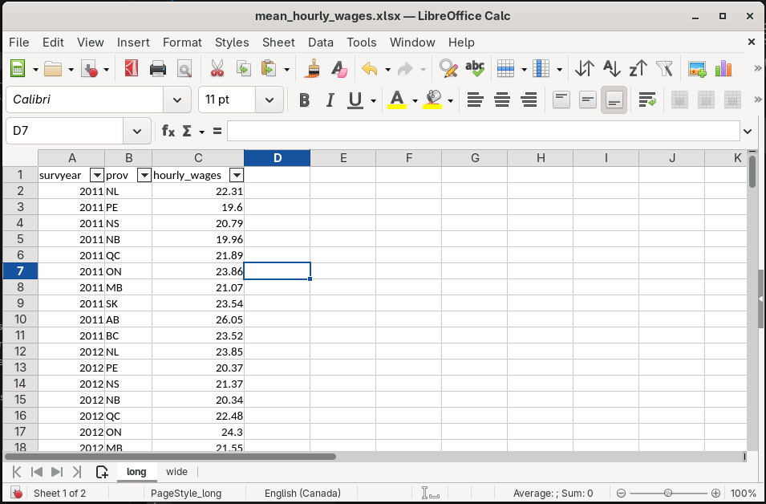
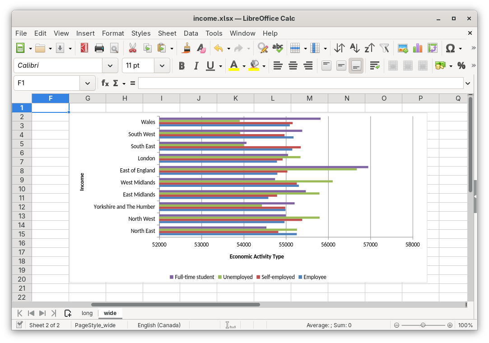

# Excel

In the data analysis world, Excel is still the universal aggregate statistics exchange format and quick analysis tool. It is much simpler to send a fellow researcher an Excel file with some summary statistics or a few hundred rows of data than it is to send pretty much any other data format. With the following code, you can export any data from Polars to Excel, format it as needed and even add plots.

## Setup

First, lets create some summary statistics to throw into the excel file. We will create a table of mean income by region and economic activity type, in a long format (e.g. 3 columns: "region", "econ" and "income") and wide format (e.g. "region" as row and "econ" as column). Both `df_long` and `df_wide` are brought into memory as data frames.

```rust
=== Rust 5_1_1_excel imports
=== Rust 5_1_1_excel block_1
```

Long:

```
shape: (40, 3)
┌────────────┬───────────────────┬──────────┐
│ region     ┆ econ              ┆ income   │
│ ---        ┆ ---               ┆ ---      │
│ str        ┆ str               ┆ f64      │
╞════════════╪═══════════════════╪══════════╡
│ North East ┆ Employee          ┆ 55257.6  │
│ North East ┆ Self-employed     ┆ 54819.89 │
│ North East ┆ Unemployed        ┆ 55263.29 │
│ North East ┆ Full-time student ┆ 54537.93 │
│ North West ┆ Employee          ┆ 54967.04 │
│ …          ┆ …                 ┆ …        │
│ South West ┆ Full-time student ┆ 55387.28 │
│ Wales      ┆ Employee          ┆ 55091.85 │
│ Wales      ┆ Self-employed     ┆ 55160.3  │
│ Wales      ┆ Unemployed        ┆ 53905.93 │
│ Wales      ┆ Full-time student ┆ 55820.75 │
└────────────┴───────────────────┴──────────┘
```

Wide:

```
shape: (10, 5)
┌──────────────────────────┬──────────┬───────────────┬────────────┬───────────────────┐
│ region                   ┆ Employee ┆ Self-employed ┆ Unemployed ┆ Full-time student │
│ ---                      ┆ ---      ┆ ---           ┆ ---        ┆ ---               │
│ str                      ┆ f64      ┆ f64           ┆ f64        ┆ f64               │
╞══════════════════════════╪══════════╪═══════════════╪════════════╪═══════════════════╡
│ North East               ┆ 55257.6  ┆ 54819.89      ┆ 55263.29   ┆ 54537.93          │
│ North West               ┆ 54967.04 ┆ 55386.59      ┆ 55798.25   ┆ 54996.17          │
│ Yorkshire and The Humber ┆ 54990.37 ┆ 54984.78      ┆ 54432.41   ┆ 55206.45          │
│ East Midlands            ┆ 54583.73 ┆ 54791.05      ┆ 55793.84   ┆ 55471.23          │
│ West Midlands            ┆ 55306.15 ┆ 55257.88      ┆ 56108.3    ┆ 54742.85          │
│ East of England          ┆ 54797.87 ┆ 55034.25      ┆ 56679.84   ┆ 56950.45          │
│ London                   ┆ 54789.13 ┆ 54922.37      ┆ 55346.13   ┆ 55049.89          │
│ South East               ┆ 55151.04 ┆ 55352.0       ┆ 54001.1    ┆ 54065.4           │
│ South West               ┆ 55179.63 ┆ 54966.94      ┆ 53915.38   ┆ 55387.28          │
│ Wales                    ┆ 55091.85 ┆ 55160.3       ┆ 53905.93   ┆ 55820.75          │
└──────────────────────────┴──────────┴───────────────┴────────────┴───────────────────┘
```

## Excel

To write this data to Excel, we can use the [polars_excel_writer](https://docs.rs/polars_excel_writer/latest/polars_excel_writer/) crate to write Polars data from a `DataFrame` into Excel. This crate uses the [rust_xlsxwriter](https://docs.rs/rust_xlsxwriter/latest/rust_xlsxwriter/) crate for this, and we can use the other options in the `rust_xlsxwriter` crate to do anything you can do in Excel. 

First, lets create an Excel workbook and write our `df_long` to the "long" worksheet. Note that nothing has been saved yet, but the screenshots are taken as if it had been saved. The workbook is currently in-memory and will be written at the end of this section.

```rust
=== Rust 5_1_1_excel block_2
```



Next, we can add a second worksheet, called "wide" with the wide data from `df_wide`:

```rust
=== Rust 5_1_1_excel block_3
```


Now that we have the data into excel, we can use `rust_xlsxwriter` to manipulate the worksheet and add anything. Here, we add a bar chart based on the data from `df_wide`, found in the "wide" worksheet:

```rust
=== Rust 5_1_1_excel block_4
```



Lastly, we can save all of this to the `./data/output/income.xlsx` folder:

```rust
=== Rust 5_1_1_excel block_5
```