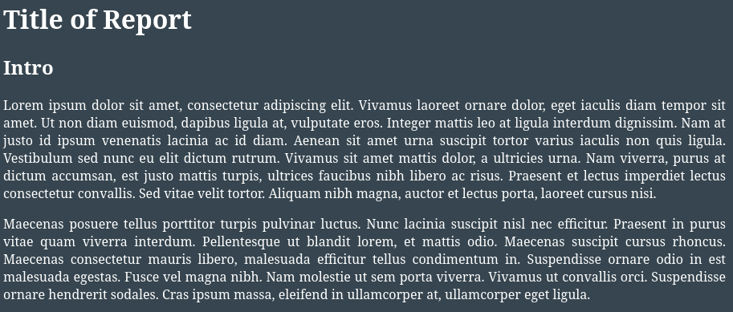
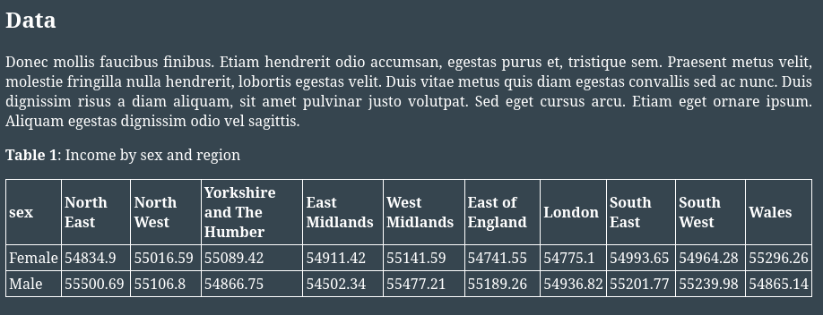
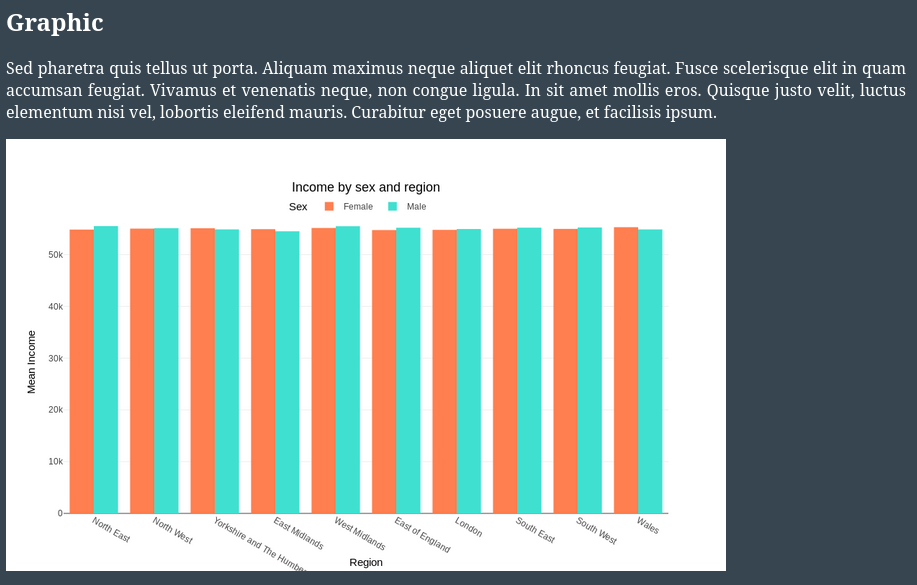
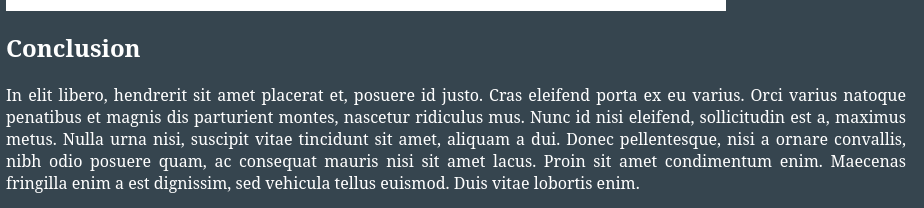

# Reports

Reports are one of the most important ways data analysts can communicate with their non-technical audience. This chapter will explore how to create a short report in [Markdown](https://www.markdownguide.org/), using [comrak](https://docs.rs/comrak/latest/comrak/), a markdown parser that can output to HTML.

For longer and more in-depth reports, this book is, itself, the a good example example. Instead of writing about data analysis in Rust, it could write about a specific data analysis. This book uses [mdBook](https://rust-lang.github.io/mdBook/), a Rust command line tool to create markdown books. You can find the source code of this book [here](https://github.com/EricFecteau/rust-data-analysis).

Run this code using `cargo run -r --example 5_3_1_reports`.

## Setup and formatting

The output of the report will be an HTML file that can be opened in a browser. Therefore, the first step is to create an HTML file as output:

```rust
=== Rust 5_3_1_reports imports
=== Rust 5_3_1_reports block_1
```

Next, because `comrak` does not provide any styling, we will use [css](https://www.w3schools.com/css/) to give our report some style: 

```rust
=== Rust 5_3_1_reports block_2
```

Lastly, we need to modify some of the [config options](https://docs.rs/polars/latest/polars/#config-with-env-vars) of `polars` so that it can output it's table to a nice-looking markdown style:

```rust
=== Rust 5_3_1_reports block_3
```

> [!NOTE]
> Note that this code is wrapped in Rust's `unsafe {}`. This is not uncommon in Rust, as it's a way to explicitly force the user to acknowledge that the code they are using could potentially cause memory issues or not be thread-safe. As explained in the documentation of [set_var](https://doc.rust-lang.org/std/env/fn.set_var.html#safety), "This function is safe to call in a single-threaded program." and "This function is also always safe to call on Windows, in single-threaded and multi-threaded programs.". This function is only unsafe in multi-treaded programs. This program is single threaded, so no concerns here! I recommend exploring the [unsafe rust](https://doc.rust-lang.org/book/ch20-01-unsafe-rust.html) documentation a bit to familiarize yourself with safety in Rust. 

We have now setup the formats needed to create a nice looking markdown report!

## Report

### Titles and intro

A markdown document is simply one long peice of text that needs to be rendered. So we start off here with a string called `markdown`. We will continue to append more markdown text to this variable with `push_str`. As you can see, in this section we create a title (starts with a `#`), a sub-title (sstarts with a `##`) and a paragraph (using [placeholder text](https://en.wikipedia.org/wiki/Lorem_ipsum)).

```rust
=== Rust 5_3_1_reports block_4
```



### Data table

We can add a markdown data table to the html document by calling `.to_string()` on a `DataFrame` (not a `LazyFrame`, don't forget to `.collect()`). To do this, as learned in the [summary statistics chapter](../4_stats/1_summary.md) we connect to the census data, create a summary table of the mean income by sex and region and pivot it for better display. We can then add the table string to the `markdown` variable.

```rust
=== Rust 5_3_1_reports block_5
```



### Image

We can also add images to the markdown document, using the `` format. To do this, as learned in the [plotting chapter](2_plotting.md), we can use the data table we just created and pass it to `plotlars`. 

```rust
=== Rust 5_3_1_reports block_6
```



### Conclusion

Similar to the intro, we can add a conlusion.

```rust
=== Rust 5_3_1_reports block_7
```



## Finalizing

Lastly, we must render the markdown to HTML, close up our HTML opened earlier in this chater, and save the HTML to file.

```rust
=== Rust 5_3_1_reports block_8
```

With all this done, you can see the final report [here]().